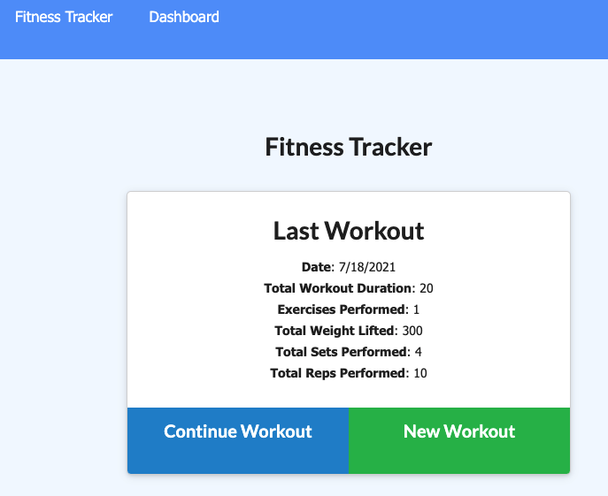
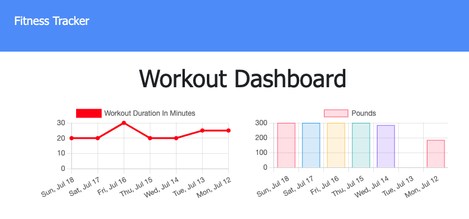

# Fitness Tracker - Mongo


## Description
This is a fitness tracker app that uses MongoDB and mongoose. The front end code was provided and I was tasked with creating the back-end. 
## Table of Contents
- [Installation](#installation)
- [Usage](#usage)
- [Contributions](#contributions)
- [Testing Information](#testing)
- [License](#license)
- [Questions](#questions)
## Installation
Run ```npm i``` to install the dependencies.
## Usage
Run ```npm run start```




## Contributions
[](code_of_conduct.md)

## Testing
No testing included in this project.

## License
This project is covered under a/an MIT license. For more information see GitHub documentation on licensing a project [here](https://docs.github.com/en/communities/setting-up-your-project-for-healthy-contributions/adding-a-license-to-a-repository).

## Questions
​For questions, get in touch on [GitHub](https://github.com/bryan-barnes12/) or email me at [theonlysweetbeebles@gmail.com](mailto:theonlysweetbeebles@gmail.com).
    